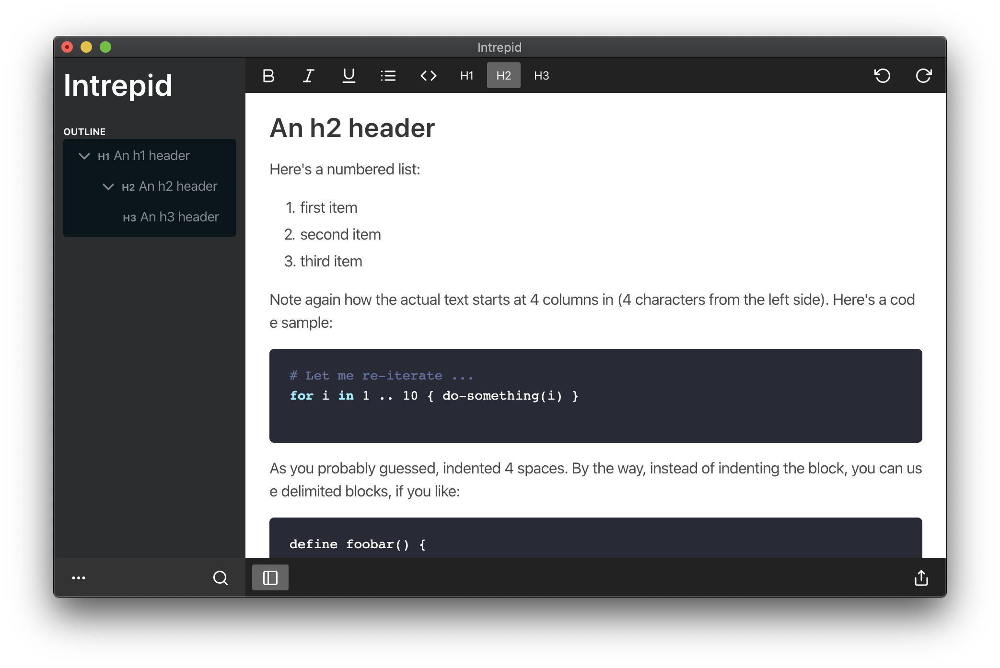

# Intrepid 

> A note-taking app for macOS

## Features

### Familiar Markdown syntax

- Headings
- Bold, italicized, justified text
- Code + syntax highlighting
- Images

### Image handling

#### Local images:

One of the core principles behind Intrepid is that your data must be portable. For a new, unsaved file, pasted or dropped images are embedded as Base64 encoded strings. When the file is saved, these images are extracted to an assets folder inside your file. From then on, all new images are added to the assets folder. 

#### Remote images:

Use the Markdown image syntax. All these links will remain unchanged. 

